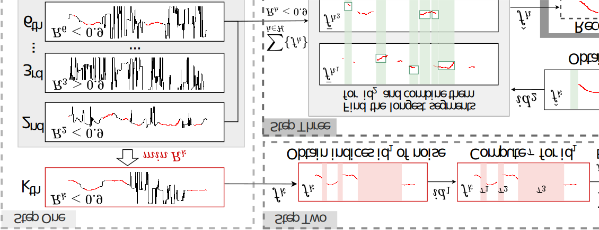

# About
This repository comprises the ENF-SAH audio dataset, encompassing considerably contaminated short ENF signals, along with their corresponding reference and one-day reference datasets, collected on the campus of Wuhan University. In addition, the repository provides  Matlab programs for extracting and estimating ENF, as well as a display of the corresponding visualization results. These resources can help you better understand and utilize this audio dataset.
# ENF-SAH Dataset
* Recording location: restaurants, playground, gymnasium, parking lot, square, library and lawn.
* Environment diversity: day/night, interior/exterior.
* Recording device: Redmi K40, Aigo R6633, iPad Air4, Tascam DR-07x, Philips VTR7100, and iPhone 13.
* Duration: 2~10 minutes
* Format: PCM WAVE
* Quantization depth: 16-bit
* Channel: mono
* Sampling frequency: 8000 Hz (400 Hz for reference data)
* Category:
  * enf_audio: "01~40.wav" 40 real-world recordings with captured ENF.
  * ref_audio: "ref_01~ref_40.wav" the corresponding 40 reference ENF (noise-free, same duration) obtained from power main.
  * ref_one_day: the corresponding one-day (24 hours) reference ENF for the 40 recordings. "3-5,23.wav" means "03.wav", "04.wav", "05.wav" and "23.wav" in enf_audio folder are recorded within the same day.
# Note about the Ground-Truth 
The ground-truth matched location (the lag that corresponds to the true timestamp) can be determined by aligning noise-free reference files with their respective one-day references. For instance, matching "ref_05.wav" in "ref_audio" folder with "3-5,23.wav" in "ref_one_day" folder yields the lag index, serving as the ground truth timestamp for "05.wav" in "enf_audio" folder. This implies that "05.wav" should align with the same or very close lag index in "3-5,23.wav". Both MSE and CC can be used for the matching criterion as long as the recording and ref are matched using the same criterion.
# Matlab Programs
It contains our adaptive-window-based harmonic recombination (AWHR) method, which is effective in short-contaminated audio. Here we provide the steps on how to use AWHR to process ENF signals.

* Step 1: Data Preparation
  
    To begin, you'll need to gather the necessary audio files that include ENF signals, corresponding reference signals, and a reference database for a specific time to facilitate later experimental verification. For instance, you can make use of '02.wav' from the 'enf_audio' folder, 'ref_02.wav' from the 'ref_audio' folder, and '2,19, 21, 24.wav' from the 'ref_one_day' folder to achieve the desired results.
* Step 2: Data Preprocessing

   Moving on to the next stage, start by reading the '02.wav' audio file. Subsequently, apply bandpass filtering to remove any noise that falls outside the designated frequency band. Additionally, since the reference files 'ref_02.wav' and '2,19, 21, 24.wav' are noise-free, you can directly extract information from them using the Short Time Fourier Transform (STFT) technique.

* Step 3: Data Processing

  In this pivotal step, the ENF harmonic signals obtained in Step 2 undergo the AWHR processing, following the workflow illustrated in the accompanying figure. You can find the MATLAB program necessary for this processing in the "AWHR" folder.By following these steps, you'll be able to effectively utilize AWHR to process ENF signals, enhancing the quality of your audio data.

* Step 4: Signal Quality Assessment

  This step allows you to evaluate the performance of AWHR on ENF-SAH. To achieve this, CC and NRR are employed as performance metrics. CC quantifies the correlation between the ENF and the reference signal, indicating their level of correlation. On the other hand, NRR assesses the presence of noisy samples within the ENF signal, providing insights about its overall quality.

  In the figure below, you'll find a comparative graph displaying the estimated ENF signal alongside the reference signal after AWHR processing for '02.wav'. This graph also shows the CC and NRR values, effectively illustrating the proficiency of AWHR.

  To further validate the practical efficacy of AWHR, you can perform timestamp verification on the estimated signal within a single day. The comparison between the estimated signal derived from '02.wav' and the timestamp verification result is depicted in the following figure, offering further evidence of AWHR's effectiveness.

 

  Additionally, to showcase the superiority of our method, we conducted comparisons with the following existing works:

* Robust filtering algorithm (RFA) [1],
* Harmonic robust filtering algorithm (HRFA) and graph-based harmonic selection algorithm (GHSA) [2],
* Robust media time-stamping (RMTS) method by [S. Vatansever et al. 2022 IEEE SPL](https://ieeexplore.ieee.org/document/9882322/references#references),

  using real-world recordings from the ENF-SAH dataset. These comparisons were performed using real-world recordings from the ENF-SAH dataset. An illustrative comparison diagram between the methods is provided below for clarity.

# Citation Information
* ENF Enhancement
  >\[1] G. Hua and H. Zhang, "ENF Signal Enhancement in Audio Recordings," in IEEE Transactions on Information Forensics and Security, vol. 15, pp. 1868-1878, 2020.
  
  >\[2] G. Hua, H. Liao, H. Zhang, D. Ye and J. Ma, "Robust ENF Estimation Based on Harmonic Enhancement and Maximum Weight Clique," in IEEE Transactions on Information Forensics and Security, vol. 16, pp. 3874-3887, 2021.
* Related work
  
  

  
