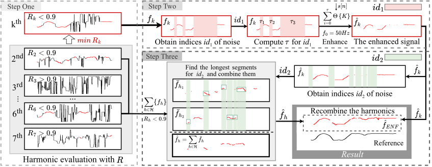

# About
This repository consists of the ENF-SAH audio dataset containing considerably contaminated short ENF signals, the corresponding reference and one-day reference, which was collected around Wuhan University. In addition, the repository provides  Matlab programs for extracting and estimating ENF, as well as a display of the corresponding visualization results. These resources can help you better understand and utilize this audio dataset.
# ENF-SAH Dataset
* Recording location: restaurants, playground, gymnasium, parking lot, square, library and lawn.
* Environment diversity: day/night, interior/exterior.
* Recording device: Redmi K40, Aigo R6633, iPad Air4, Tascam DR-07x, Philips VTR7100, and iPhone 13.
* Duration: 2~10 minutes
* Format: PCM WAVE
* Quantization depth: 16-bit
* Channel: mono
* Sampling frequency: 8000 Hz (400 Hz for reference data)
* Category:
  * enf_audio: "01~40.wav" 40 real-world recordings with captured ENF.
  * ref_audio: "ref_01~ref_40.wav" the corresponding 40 reference ENF (noise-free, same duration) obtained from power main.
  * ref_one_day: the corresponding one-day (24 hours) reference ENF for the 40 recordings. "3-5,23.wav" means "03.wav", "04.wav", "05.wav" and "23.wav" in enf_audio folder are recorded within the same day.
# Note about the Ground-Truth 
The ground-truth matched location (the lag that corresponds to the true timestamp) can be determined by aligning noise-free reference files with their respective one-day references. For instance, matching "ref_05.wav" in "ref_audio" folder with "3-5,23.wav" in "ref_one_day" folder yileds the lag index, serving as the ground truth timestamp for "05.wav" in "enf_audio" folder. This implies that "05.wav" should align with the same or very close lag index in "3-5,23.wav". Both MSE and CC can be used for the matching criterion as long as the recording and ref are matched using the same criterion.
# Matlab Programs
It contains our adaptive-window-based harmonic recombination (AWHR) method, which is effective in short-contaminated audio. Here we provide the steps on how to use AWHR to process ENF signals.

* Step 1: Data Preparation
  
The first step is to prepare audio files that contain ENF signals and corresponding reference signals and a reference database for a specific time to verify the experimental results later on. For example, you can utilize '02.wav' from the 'enf_audio' folder, 'ref_02.wav' from the 'ref_audio' folder, and '2,19, 21, 24.wav' from the 'ref_one_day' folder to get the desired results.
* Step 2: Data Preprocessing

Moving on to the next step, begin by reading the '02.wav' audio file and then applying bandpass filtering to eliminate any noise that falls outside of the frequency band. Furthermore, since the reference documents 'ref_02.wav' and '2,19, 21, 24.wav' do not have any noise, you can directly extract them using Short Time Fourier Transform (STFT).

* Step 3: Data Processing

In this step, the ENF harmonic signals extracted in step 2 undergo AWHR processing according to the workflow depicted in the below figure.  The matlab program is given in the floder "AWHR".

* Step 4: Signal Quality Assessment
In this step, you can access the performance of AWHR on ENF-SAH. To do this, CC and NRR are used as performance criteria. CC measures  the correlation between the ENF and the reference signal, indicating their level of correlation. NRR gauges the presence of noisy samples in the ENF signal, providing insights into its overall quality.

In the figure below, you can see a comparison graph of the estimated ENF and reference signal after AWHR processing for '02.wav'. The graph also showcases the CC and NRR, which demonstrate the effectiveness of AWHR. 

To further validate the effectiveness of AWHR in practical applications, you could conduct timestamp verification on the estimated signal within one day. The comparison between the estimated signal from '02.wav' and the timestamp verification result is shown in the following figure, which further illustrates the effectiveness of AWHR.

Additionally, to showcase the superiority of our method, we compared it with the following existing work:

* Robust filtering algorithm (RFA) [1],
* Harmonic robust filtering algorithm (HRFA) and graph-based harmonic selection algorithm (GHSA) [2],
* Robust media time-stamping (RMTS) method by [S. Vatansever et al. 2022 IEEE SPL](https://ieeexplore.ieee.org/document/9882322/references#references),

using real-world recordings from the ENF-SAH dataset. These comparisons were performed using real-world recordings from the ENF-SAH dataset. An illustrative comparison diagram between the methods is provided below for clarity.

# Citation Information
* ENF Enhancement
  >\[1] G. Hua and H. Zhang, "ENF Signal Enhancement in Audio Recordings," in IEEE Transactions on Information Forensics and Security, vol. 15, pp. 1868-1878, 2020.
  
  >\[2] G. Hua, H. Liao, H. Zhang, D. Ye and J. Ma, "Robust ENF Estimation Based on Harmonic Enhancement and Maximum Weight Clique," in IEEE Transactions on Information Forensics and Security, vol. 16, pp. 3874-3887, 2021.
* Related work
  
  

  
